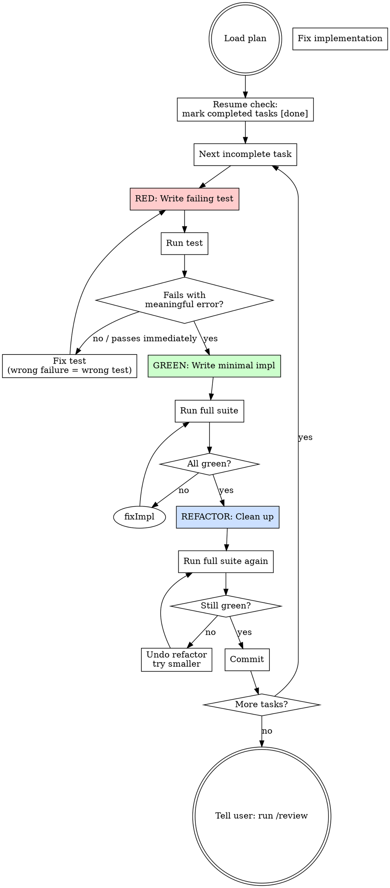

# Build — Test-Driven Implementation

Implement the plan task by task. Red → Green → Refactor → Commit.

## Process Flow



## Starting Check

Look for the latest plan in `docs/plans/` using this resolution order:
1. Sort files matching `docs/plans/YYYY-MM-DD-*.md` by filename descending
2. If multiple files share the same date, ask the user to select
3. If no files match the pattern, prompt: "No plan found. Run `/plan` first, provide a path, or describe the tasks inline to continue without a plan."

**Resuming a partial build:** Before starting, scan each task in the plan and check if its files already exist and its acceptance criteria are met. List completed tasks as `[done]` and begin from the first incomplete task. Do not re-implement tasks that already pass.

## The Iron Law

```
NO PRODUCTION CODE WITHOUT A FAILING TEST FIRST
```

If you wrote implementation code before a failing test:
- **Delete it.** Not "keep as reference." Delete it.
- Start over with the test.
- No exceptions. Not even for "obvious" code.

This applies to: functions, classes, API handlers, data transformations, validation logic, business rules.

This does NOT apply to: database migrations, environment config files, generated code, infrastructure definitions, CSS/styling. For these, document what you changed and why in a comment.

Thinking "skip TDD just this once"? That's rationalization. Stop.

## The TDD Loop

For each task in the plan, repeat:

**1. Write the failing test**
- Write the smallest test that proves the specific behavior
- Run it — verify it FAILS with a meaningful error (not a syntax error)
- If it passes immediately, your test is wrong — fix it

**2. Write minimal implementation**
- Write only enough code to make the test pass
- No extra logic, no "while I'm here" additions
- If you're writing code that no test exercises, stop and write the test first

**3. Verify green**
- Run the test — verify it passes
- Run the full test suite — verify nothing regressed

**4. Refactor**
- Review what you just wrote: rename for clarity, extract duplication, simplify conditionals
- Only touch code covered by the tests you just wrote — no drive-by refactors
- Run the full test suite again — still green? Proceed. Broke something? Undo and try a smaller refactor.

**5. Commit**
```bash
git add <test-file> <implementation-file>
git commit -m "<type>: [what this task implements]"
```
Choose the commit type based on the change: `feat:` for new functionality, `fix:` for bug fixes, `refactor:` for restructuring without behavior change, `test:` for test-only changes.

**6. Move to next task**

## Unit Design Rules

Each unit (function, class, module) must:
- Have one clear purpose expressible in one sentence
- Be understandable without reading its internals
- Be independently testable without setting up unrelated state

If you can't describe what a unit does in one sentence, it's doing too much. Split it.

## TDD Applicability

The "failing test first" rule applies to application logic and business rules only.

Exceptions — document instead of test:
- **Database migrations** → comment explaining what the migration does and why
- **Environment/config files** → comment explaining each setting's purpose
- **Generated code** → note what generates it and how to regenerate
- **Infrastructure definitions** → describe the resource and its intended state

## Chaining

After completing all tasks:
> "Build complete. Run `/review` for production bug, security, and plan compliance checks before shipping."
