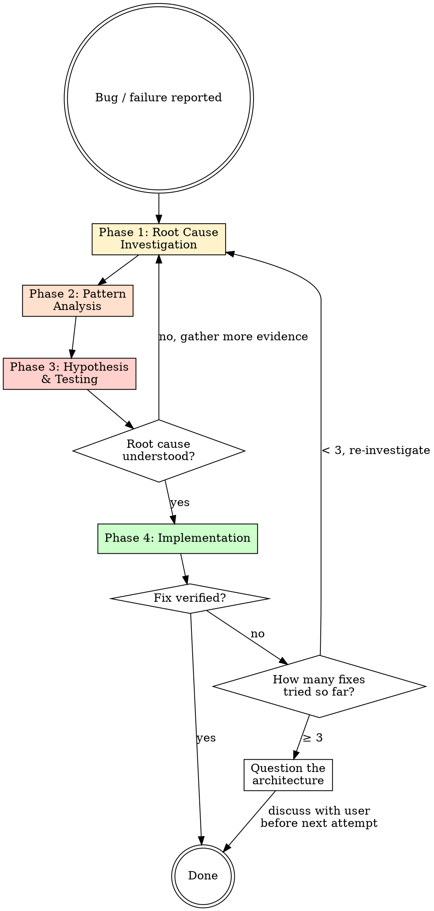

# Debug — Systematic Root Cause Analysis

Random fixes waste time and create new bugs. Quick patches mask underlying issues.

**Core principle:** Find root cause before attempting fixes. Symptom fixes are failure.

## The Iron Law

```
NO FIXES WITHOUT ROOT CAUSE INVESTIGATION FIRST
```

If you haven't completed Phase 1, you cannot propose fixes. Not even "obvious" ones.

## Process Flow



## When to Use

Use for ANY technical issue:
- Test failures
- Bugs in production
- Unexpected behavior
- Performance problems
- Build failures
- Integration issues

**Use this ESPECIALLY when:**
- Under time pressure (emergencies make guessing tempting)
- "Just one quick fix" seems obvious
- You've already tried multiple fixes and they didn't work
- You don't fully understand the issue

**Don't skip when:**
- Issue seems simple (simple bugs have root causes too)
- You're in a hurry (systematic is faster than thrashing)

---

## Phase 1: Root Cause Investigation

**BEFORE attempting ANY fix:**

### 1. Read Error Messages Carefully
- Don't skip past errors or warnings — they often contain the exact answer
- Read stack traces completely, not just the top line
- Note line numbers, file paths, error codes

### 2. Reproduce Consistently
- Can you trigger it reliably?
- What are the exact steps?
- Does it happen every time, or only sometimes?
- If not reproducible → gather more data, don't guess

### 3. Check Recent Changes
```bash
git diff HEAD~5..HEAD
git log --oneline -10
```
- What changed that could cause this?
- New dependencies, config changes, environmental differences?

### 4. Gather Evidence in Multi-Component Systems

When the system has multiple components (API → service → database, CI → build → deploy):

**Add diagnostic instrumentation at each boundary:**
```
For EACH component boundary:
  - Log what data enters the component
  - Log what data exits the component
  - Verify state at each layer

Run once to see WHERE it breaks.
THEN investigate that specific component.
```

Example:
```bash
# Layer 1
echo "Input to component A: $INPUT"

# Layer 2
echo "Output from A, input to B: $INTERMEDIATE"

# Layer 3
echo "Final output: $OUTPUT"
```

This reveals which layer fails without guessing.

### 5. Trace Data Flow (for errors deep in the call stack)

Trace backward from the failure:
- Where does the bad value originate?
- What called this with the bad value?
- Keep tracing up until you find the source.
- Fix at source, not at symptom.

---

## Phase 2: Pattern Analysis

**Find the pattern before fixing:**

1. **Find working examples** — locate similar working code in the same codebase. What does the working version do differently?

2. **Compare against references** — if implementing a pattern, read the reference implementation completely. Don't skim. Understand it fully before applying.

3. **Identify differences** — list every difference between working and broken, however small. Don't assume "that can't matter."

4. **Understand dependencies** — what settings, config, environment does the broken component assume?

---

## Phase 3: Hypothesis and Testing

**Scientific method:**

1. **Form a single hypothesis** — state clearly: "I think X is the root cause because Y." Be specific.

2. **Test minimally** — make the smallest possible change to test the hypothesis. One variable at a time.

3. **Verify before continuing:**
   - Worked? → Phase 4
   - Didn't work? → Form a NEW hypothesis, return to Phase 1 with new information
   - Do NOT stack more fixes on top of a failed fix

4. **When you don't know** — say "I don't understand X." Don't pretend. Ask or investigate more.

---

## Phase 4: Implementation

**Fix the root cause, not the symptom:**

### 1. Write a Failing Test Case First
- Write the simplest possible reproduction as an automated test
- Use the `/build` TDD loop to write it
- This test must exist before you change any application code

### 2. Implement a Single Fix
- Address the root cause identified in Phase 1
- ONE change at a time
- No "while I'm here" improvements
- No bundled refactoring

### 3. Verify the Fix
- The new test passes?
- No other tests regressed?
- Original symptom is actually gone?

### 4. If the Fix Doesn't Work — Stop and Count

- **< 3 fixes tried:** Return to Phase 1. Re-investigate with the new information the failed fix revealed.
- **≥ 3 fixes tried:** This is an architectural problem. Stop.

### 5. When 3+ Fixes Have Failed: Question the Architecture

Signs you're in architectural territory:
- Each fix reveals a new problem in a different component
- Fixes require touching many files to implement
- Each fix creates new symptoms elsewhere

**Stop fixing symptoms. Ask:**
- Is this design pattern fundamentally sound?
- Are we stuck with it through inertia, or for real reasons?
- Should we refactor the architecture vs. continue patching?

Discuss with the user before attempting another fix.

---

## Red Flags — STOP and Return to Phase 1

If you catch yourself thinking any of these:
- "Quick fix for now, investigate later"
- "Just try changing X and see if it works"
- "It's probably X, let me fix that"
- "I don't fully understand but this might work"
- "One more fix attempt" (when already tried 2+)
- Proposing solutions before tracing data flow
- Each fix reveals a new problem in a different place

**These all mean: STOP. Return to Phase 1.**

## Common Rationalizations

| Excuse | Reality |
|--------|---------|
| "Issue is simple, don't need process" | Simple bugs have root causes too. The process is fast for simple bugs. |
| "Emergency, no time for process" | Systematic is FASTER than guess-and-check thrashing. |
| "Just try this first, then investigate" | First fix sets the pattern. Do it right from the start. |
| "I'll write the test after confirming the fix works" | Untested fixes don't stick. Test first proves it. |
| "Multiple fixes at once saves time" | Can't isolate what worked. Creates new bugs. |
| "I see the problem, let me fix it" | Seeing symptoms ≠ understanding root cause. |
| "One more fix" (after 2+ failures) | 3+ failures = architectural problem. Question the pattern. |

## Quick Reference

| Phase | Key Activities | Exit Criteria |
|-------|---------------|---------------|
| **1. Root Cause** | Read errors, reproduce, check changes, add instrumentation | Understand WHAT and WHY |
| **2. Pattern** | Find working examples, compare differences | Identify what's different |
| **3. Hypothesis** | State theory, test minimally, one variable | Theory confirmed or replaced |
| **4. Implementation** | Write failing test, single fix, verify | Tests pass, symptom gone |

## When Investigation Reveals "No Root Cause"

If systematic investigation reveals the issue is truly environmental, timing-dependent, or external:

1. You've completed the process — that's a valid outcome
2. Document what you investigated and ruled out
3. Implement appropriate handling (retry logic, timeout, error message)
4. Add logging for future investigation

**But:** 95% of "no root cause" cases are incomplete investigation.

## Chaining

After the fix is verified:
> "Bug fixed. Root cause: [one sentence]. Fix: [what changed]. Run `/review` if the fix touches application logic, or `/verify` before claiming it's done."
