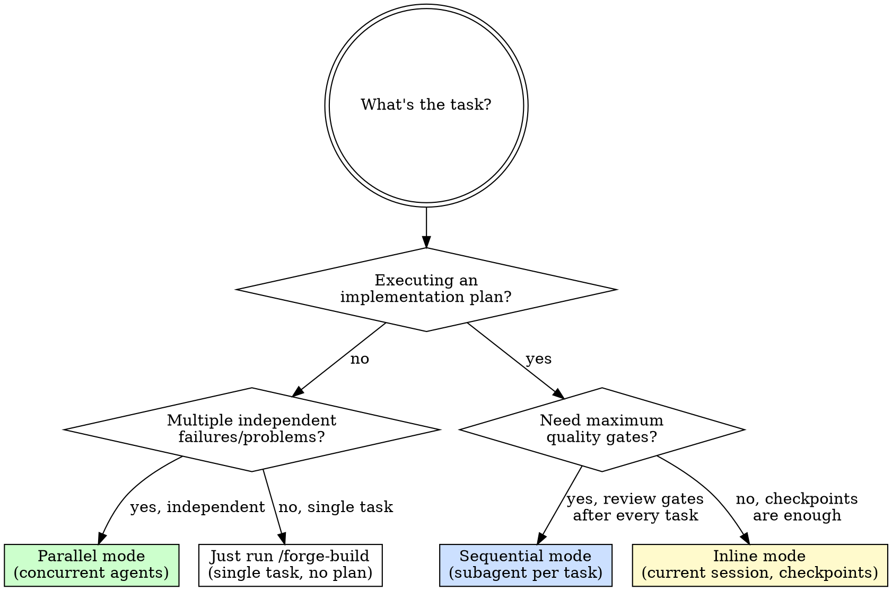
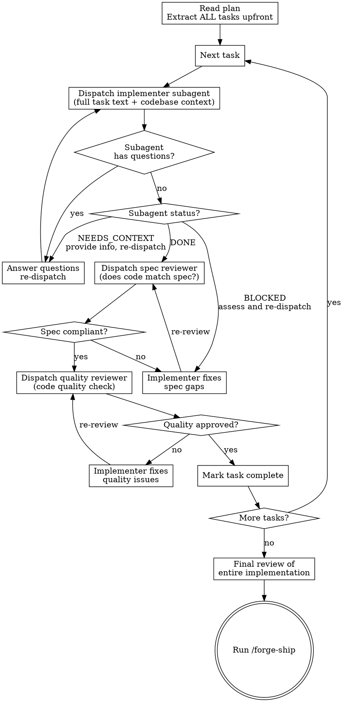
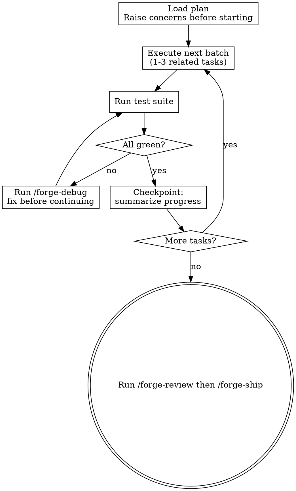
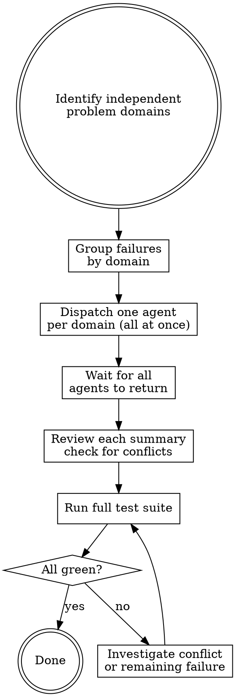

# Subagent — Isolated Execution with Review Gates

You delegate tasks to agents with precisely crafted, isolated context. They never inherit your session history — you construct exactly what they need. This keeps each agent focused and preserves your context for coordination.

**Three modes:**
- **Sequential** — Execute a plan task by task. Fresh subagent per task + two-stage review (spec compliance → code quality) after each.
- **Inline** — Execute a plan directly in this session, batch by batch, with a checkpoint after each batch. Simpler, no subagent overhead.
- **Parallel** — Dispatch multiple agents concurrently for independent problems.

## Agent Roles

Every subagent has a role. A role definition gives the agent a precise identity: who they are, what their mandate is, what they cannot do, and exactly how to format their output. This eliminates ambiguity — the agent does not fill gaps with assumptions.

| Role file | Agent type | Mandate |
|-----------|-----------|---------|
| `roles/implementer.md` | Implementer | TDD implementation of a single scoped task |
| `roles/spec-reviewer.md` | Spec Reviewer | Binary compliance audit: spec vs. implementation |
| `roles/quality-reviewer.md` | Quality Reviewer | Production-readiness check (not spec compliance) |
| `roles/debugger.md` | Debugger | Root cause investigation and fix |

**How to inject a role:** Read the role file, prepend its full content to the subagent prompt, add `---` as a separator, then add task-specific context. See the prompt templates below.

## Model Selection

Use the least capable model that can do the job. Cheaper models complete mechanical tasks faster and preserve budget for the tasks that actually need reasoning.

| Role | Recommended model | Reason |
|------|------------------|--------|
| Implementer | `haiku` | Mechanical TDD cycle — test + implement + commit. Follows a procedure, not reasoning under uncertainty. |
| Spec Reviewer | `haiku` | Pattern matching — spec text vs. implementation. Binary output. |
| Quality Reviewer | `sonnet` | Judgment calls — assessing production risk, classifying severity. |
| Debugger | `sonnet` | Reasoning-intensive — tracing root cause across a call stack. |
| Final review / complex architecture | `opus` | When the problem spans many files and requires deep reasoning. |

**To specify model when dispatching via Agent tool:**
```
model: "haiku"   → claude-haiku-4-5-20251001
model: "sonnet"  → claude-sonnet-4-6
model: "opus"    → claude-opus-4-6
```

When in doubt: start with `haiku`, upgrade to `sonnet` if the subagent reports `NEEDS_CONTEXT` or produces shallow output.

## When to Use Which Mode



---

## Sequential Mode — Plan Execution

Execute a plan from `docs/plans/` one task at a time. Fresh subagent implements each task; two reviewers check the result before moving on.

**Core principle:** Fresh subagent per task + spec compliance first + code quality second = high quality without context pollution.

### Process Flow



### Role Injection

Every subagent prompt begins with its role definition. This gives the agent a precise identity — who they are, what they can and cannot do — before they see any task context. Role definitions live in `roles/` and are prepended verbatim.

**To build a subagent prompt:**
1. Read the appropriate role file from `roles/`
2. Append `---` as a separator
3. Append the task-specific context below

This is not optional. A subagent without a role is a blank slate that will fill in gaps with assumptions.

---

### Implementer Prompt Template

```
[PASTE FULL CONTENT OF roles/implementer.md HERE]

---

Task: [Task N name from plan]

Codebase context:
- Tech stack: [language, framework, test runner]
- Relevant existing files: [list files the task touches — these are your scope]
- Conventions to follow: [test naming, import style, etc.]

Task specification:
[Full task text from the plan, verbatim — do NOT summarize]
```

---

### Spec Reviewer Prompt Template

```
[PASTE FULL CONTENT OF roles/spec-reviewer.md HERE]

---

Task N specification (what the implementer was supposed to build):
[Full task text from plan, verbatim]

Changed files since last task:
[List commits and changed files]

Audit each requirement. Produce the verdict table and final verdict.
```

---

### Quality Reviewer Prompt Template

```
[PASTE FULL CONTENT OF roles/quality-reviewer.md HERE]

---

Changed files (spec compliance already verified):
[List commits and changed files since last task]

Review for production readiness. Produce the verdict.
```

---

### Debugger Prompt Template

```
[PASTE FULL CONTENT OF roles/debugger.md HERE]

---

Failing tests:
1. "[test name]" — [error message and stack trace]
2. "[test name]" — [error message and stack trace]

Your scope: ONLY [this file / this subsystem].
```

### Handling Subagent Status

| Status | Action |
|--------|--------|
| `DONE` | Proceed to spec review |
| `DONE_WITH_CONCERNS` | Read the concerns. If about correctness/scope, address first. If observations only, proceed to review. |
| `NEEDS_CONTEXT` | Provide the missing information, re-dispatch |
| `BLOCKED` | Assess: context problem → provide more + re-dispatch. Task too large → split. Plan wrong → escalate to user. |

**Never** ignore an escalation or re-dispatch the same subagent with no changes.

---

## Inline Mode — Direct Session Execution

Execute the plan in the current session. No subagent overhead. Uses checkpoints after each batch so you can review progress without losing context.

**Use when:** Plan is well-specified, tasks are mostly sequential, and you don't need per-task review gates.

### Process Flow



### Steps

**1. Load and review the plan**
Read the full plan. If anything is unclear or contradictory, raise it before starting — not mid-execution.

**2. Execute in batches**
Group 1-3 related tasks per batch. For each task, follow the TDD loop from `/forge-build` (failing test → minimal impl → refactor → commit). Do not skip the commit.

**3. Run the full test suite after each batch**
If any test fails, stop immediately. Run `/forge-debug` to find root cause before continuing. Do not bundle bug fixes into the next batch.

**4. Checkpoint**
After each batch, summarize:
```
Batch N complete:
- Tasks done: [list]
- Tests: N passing
- Remaining: [list]
- Any concerns: [or "none"]
```

**5. Stop when blocked**
If a task has a missing dependency, unclear instruction, or failing test that can't be explained — stop and ask. Do not guess or push through.

---

## Parallel Mode — Independent Problems

When multiple unrelated failures exist across different subsystems, investigate them concurrently rather than sequentially.

### When to Use Parallel Mode

**Use when:**
- 2+ test files failing with different root causes
- Multiple subsystems broken independently
- Each problem can be understood without context from the others
- No shared state — agents won't edit the same files

**Don't use when:**
- Failures are related (fixing one might fix others)
- You don't yet know what's broken (explore first)
- Agents would touch the same files (causes conflicts)

### Process Flow



### Agent Prompt Template (Parallel mode uses Debugger role)

```
[PASTE FULL CONTENT OF roles/debugger.md HERE]

---

Failing tests in [specific file or subsystem]:
1. "[test name]" — [error message and stack trace]
2. "[test name]" — [error message and stack trace]

Your scope: ONLY [this file / this subsystem]. Do not change other code.
```

### After Agents Return

1. **Read each summary** — understand what changed
2. **Check for conflicts** — did any agents touch the same files?
3. **Run the full test suite** — verify all fixes work together
4. **Spot-check** — agents can make systematic errors; review diffs

---

## Rules for Both Modes

**Never:**
- Let subagents inherit your session context — construct their prompt explicitly
- Start implementation on `main` / `master` without explicit user consent
- Skip the review loops in sequential mode (both spec + quality required)
- Dispatch parallel agents that edit the same files
- Accept "close enough" on spec compliance — not done until ✅
- Move to the next task while the current task has open review issues

**Always:**
- Answer subagent questions fully before letting them proceed
- Provide the complete task text verbatim — don't summarize
- Run the full test suite after integrating parallel agents

## Chaining

After all tasks complete (sequential) or all agents return (parallel):
> "All tasks complete. Run `/forge-review` for the full three-pass quality gate, then `/forge-ship`."
