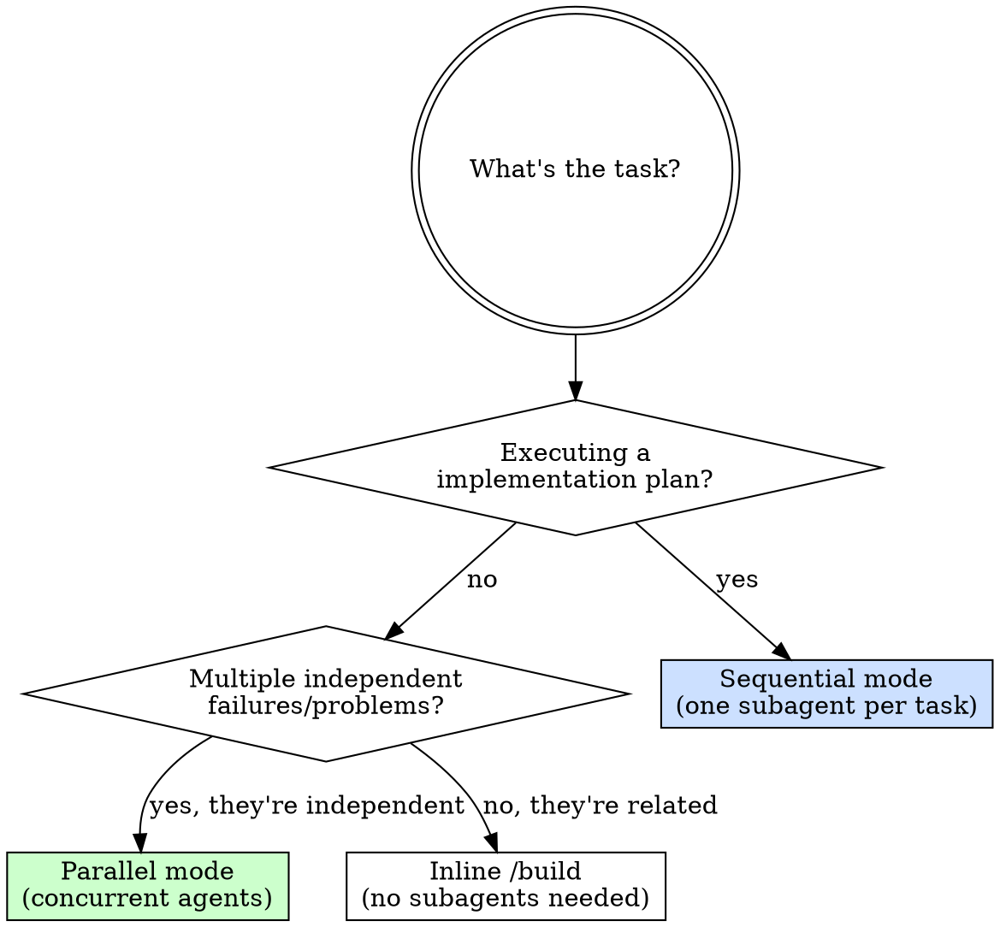
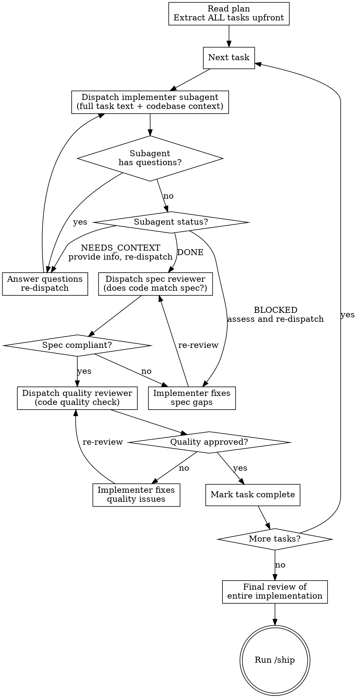
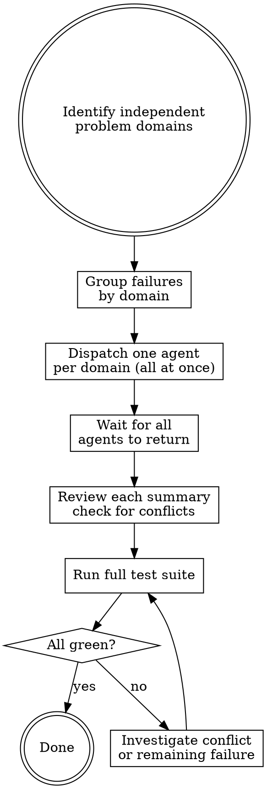

# Subagent — Isolated Execution with Review Gates

You delegate tasks to agents with precisely crafted, isolated context. They never inherit your session history — you construct exactly what they need. This keeps each agent focused and preserves your context for coordination.

**Two modes:**
- **Sequential** — Execute a plan task by task. Fresh subagent per task + two-stage review (spec compliance → code quality) after each.
- **Parallel** — Dispatch multiple agents concurrently for independent problems.

## When to Use Which Mode



---

## Sequential Mode — Plan Execution

Execute a plan from `docs/plans/` one task at a time. Fresh subagent implements each task; two reviewers check the result before moving on.

**Core principle:** Fresh subagent per task + spec compliance first + code quality second = high quality without context pollution.

### Process Flow



### Implementer Prompt Template

When dispatching the implementer subagent, provide:

```
Task: [Task N name from plan]

Codebase context:
- Tech stack: [language, framework, test runner]
- Relevant existing files: [list files the task touches]
- Conventions to follow: [test naming, import style, etc.]

Task specification:
[Full task text from the plan, verbatim — do NOT summarize]

Your job:
1. Implement using TDD (/build loop: failing test → minimal impl → refactor → commit)
2. Run the full test suite — all must pass before reporting done
3. Self-review: check for spec drift, dead code, obvious issues
4. Report status: DONE / DONE_WITH_CONCERNS / NEEDS_CONTEXT / BLOCKED

Do NOT read any other plan or spec files — use only what's provided here.
```

### Spec Reviewer Prompt Template

```
Review the implementation of Task N against this spec:

[Full task text from plan, verbatim]

Changed files:
[List commits and changed files since last task]

Check only:
1. Does the implementation fulfill every requirement in the spec?
2. Is there anything in the spec that was NOT implemented?
3. Is there anything implemented that is NOT in the spec (over-building)?

Report: ✅ COMPLIANT or ❌ ISSUES with specific gaps listed.
Do NOT evaluate code quality — that's a separate review.
```

### Quality Reviewer Prompt Template

```
Review the code quality of this implementation (spec compliance already verified):

Changed files:
[List commits and changed files since last task]

Check for:
- Race conditions, resource leaks, error paths not handled
- N+1 queries, validation gaps
- Unit design: each function has one clear purpose?
- Naming clarity, obvious duplication

Report: ✅ APPROVED or ❌ ISSUES with specific findings.
Do NOT check spec compliance — that was already verified.
```

### Handling Subagent Status

| Status | Action |
|--------|--------|
| `DONE` | Proceed to spec review |
| `DONE_WITH_CONCERNS` | Read the concerns. If about correctness/scope, address first. If observations only, proceed to review. |
| `NEEDS_CONTEXT` | Provide the missing information, re-dispatch |
| `BLOCKED` | Assess: context problem → provide more + re-dispatch. Task too large → split. Plan wrong → escalate to user. |

**Never** ignore an escalation or re-dispatch the same subagent with no changes.

---

## Parallel Mode — Independent Problems

When multiple unrelated failures exist across different subsystems, investigate them concurrently rather than sequentially.

### When to Use Parallel Mode

**Use when:**
- 2+ test files failing with different root causes
- Multiple subsystems broken independently
- Each problem can be understood without context from the others
- No shared state — agents won't edit the same files

**Don't use when:**
- Failures are related (fixing one might fix others)
- You don't yet know what's broken (explore first)
- Agents would touch the same files (causes conflicts)

### Process Flow



### Agent Prompt Template

```
Fix the failing tests in [specific file or subsystem]:

Failures:
1. "[test name]" — [error message]
2. "[test name]" — [error message]

Your scope: ONLY [this file / this subsystem]. Do not change other code.

Your task:
1. Read the failing tests and understand what each verifies
2. Identify the root cause — don't just fix symptoms
3. Fix the root cause
4. Run the suite for this file: all tests must pass
5. Return: what you found, what you changed

Do NOT increase timeouts as a fix. Do NOT change test expectations unless the behavior deliberately changed.
```

### After Agents Return

1. **Read each summary** — understand what changed
2. **Check for conflicts** — did any agents touch the same files?
3. **Run the full test suite** — verify all fixes work together
4. **Spot-check** — agents can make systematic errors; review diffs

---

## Rules for Both Modes

**Never:**
- Let subagents inherit your session context — construct their prompt explicitly
- Start implementation on `main` / `master` without explicit user consent
- Skip the review loops in sequential mode (both spec + quality required)
- Dispatch parallel agents that edit the same files
- Accept "close enough" on spec compliance — not done until ✅
- Move to the next task while the current task has open review issues

**Always:**
- Answer subagent questions fully before letting them proceed
- Provide the complete task text verbatim — don't summarize
- Run the full test suite after integrating parallel agents

## Chaining

After all tasks complete (sequential) or all agents return (parallel):
> "All tasks complete. Run `/review` for the full three-pass quality gate, then `/ship`."
