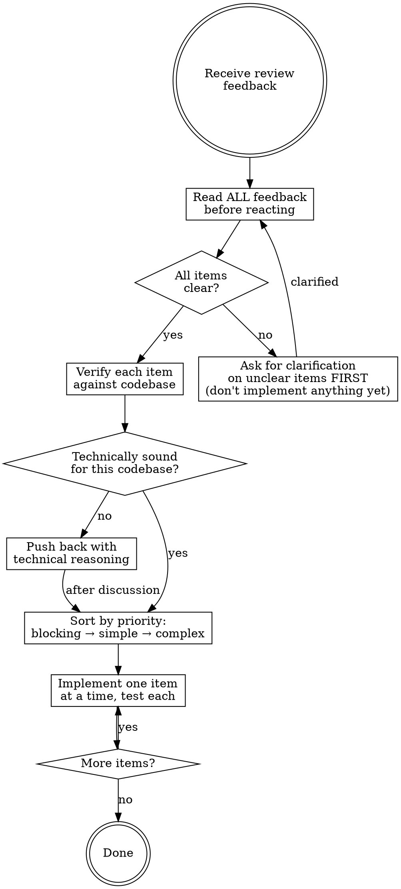

# Receive Review — Technical Evaluation, Not Performance

Code review requires technical evaluation, not emotional performance.

**Core principle:** Verify before implementing. Ask before assuming. Technical correctness over social comfort.

## Process Flow



## The Response Pattern

```
WHEN receiving code review feedback:

1. READ     — Complete feedback without reacting
2. CLARIFY  — Restate unclear items, ask before implementing
3. VERIFY   — Check each item against codebase reality
4. EVALUATE — Technically sound for THIS codebase?
5. RESPOND  — Technical acknowledgment or reasoned pushback
6. IMPLEMENT — One item at a time, test each
```

## Forbidden Responses

**NEVER say:**
- "You're absolutely right!"
- "Great point!"
- "Excellent feedback!"
- "Let me implement that now" (before verification)
- Any expression of gratitude for the feedback itself

**INSTEAD:**
- Restate the technical requirement
- Ask clarifying questions if unclear
- Push back with technical reasoning if wrong
- Just start working — actions speak louder

## Handling Unclear Feedback

If any item is unclear, **stop before implementing anything**:

```
You understand items 1, 2, 3, 6. Unclear on 4 and 5.

❌ WRONG: Implement 1,2,3,6 now. Ask about 4,5 later.
✅ RIGHT: "I understand items 1,2,3,6. Need clarification on 4 and 5 before proceeding."
```

Why: items may be related. Partial implementation with incomplete understanding = wrong result.

## Source-Specific Handling

### Feedback from the user / team
- Trusted — implement after understanding
- Still ask if scope is unclear
- Skip straight to action or technical acknowledgment

### Feedback from external reviewers (PR reviewers, linters, CI tools)
Before implementing, check:
1. Is this technically correct for THIS codebase?
2. Does it break existing functionality?
3. Is there a reason the current implementation works this way?
4. Does the reviewer have full context?
5. Does it conflict with prior architectural decisions?

If the suggestion seems wrong: push back with technical reasoning.

If you can't easily verify: say so — "I can't verify this without [X]. Should I investigate first?"

## YAGNI Check

When a reviewer suggests implementing a "proper" or "production-grade" feature:

```bash
grep -r "<feature-name>" src/
```

- Not called anywhere → "This endpoint isn't called anywhere. Remove it (YAGNI)?"
- Actually used → implement properly

Don't gold-plate code that nobody uses.

## Implementation Order (Multi-Item Feedback)

1. Clarify all unclear items FIRST
2. Then implement in this order:
   - **Blocking issues** (breaks functionality, security vulnerabilities)
   - **Simple fixes** (typos, imports, naming)
   - **Complex fixes** (refactoring, logic changes)
3. Test each fix individually
4. Verify no regressions after each

## When to Push Back

Push back when:
- Suggestion breaks existing functionality
- Reviewer lacks full context about the codebase
- Violates YAGNI (feature is unused)
- Technically incorrect for this stack or version
- Legacy/compatibility constraints exist
- Conflicts with prior architectural decisions

**How to push back:**
- Use technical reasoning, not defensiveness
- Ask specific questions ("Did you know this function is also called by X?")
- Reference working tests or code as evidence
- Loop in the user if it's an architectural call

## Acknowledging Correct Feedback

When feedback IS correct:
```
✅ "Fixed. [Brief description of what changed]."
✅ "Good catch — [specific issue]. Fixed in [file:line]."
✅ [Just fix it and show the diff — the code speaks]

❌ "You're absolutely right!"
❌ "Great point!"
❌ "Thanks for catching that!"
```

Why no thanks: actions speak. The fix itself is the acknowledgment.

## Correcting Your Own Pushback

If you pushed back and were wrong:
```
✅ "You were right — I checked [X] and it does [Y]. Implementing now."
✅ "Verified. My initial read was wrong because [reason]. Fixing."

❌ Long apology
❌ Defending why you pushed back
❌ Over-explaining
```

State the correction factually and move on.

## GitHub PR Comment Replies

When replying to inline review comments on GitHub: reply in the comment thread, not as a top-level PR comment.

```bash
gh api repos/{owner}/{repo}/pulls/{pr}/comments/{comment_id}/replies \
  -f body="[your reply]"
```

## Common Mistakes

| Mistake | Fix |
|---------|-----|
| Performative agreement | State requirement or just act |
| Blind implementation | Verify against codebase first |
| Implement without clarifying | Clarify all unclear items first |
| Assume reviewer is always right | Check if it breaks things |
| Avoid pushback | Technical correctness > comfort |
| Batch implementation without testing | One at a time, test each |

## Chaining

After implementing all review items:
> "Review addressed. Changes: [list]. Run `/verify` to confirm everything passes before marking the review resolved."
