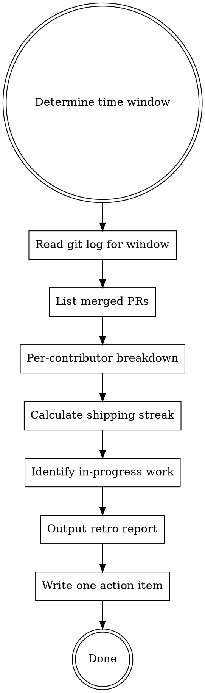

# Retro — Weekly Retrospective

Look back before looking forward. A good retro takes 5 minutes and makes the next week measurably better.

<HARD-GATE>
Do NOT change any application code, docs, or configuration during this skill. The only output is the retro report and the written action item.
</HARD-GATE>

## Process Flow



## Step 1: Determine Time Window

Default: last 7 days.

Override: if the user passes a sprint name or explicit date range (e.g., `/retro 2026-03-01..2026-03-14`), use that window instead.

```bash
git log --oneline --since="7 days ago"
# or for explicit range:
git log --oneline --after="2026-03-01" --before="2026-03-14"
```

## Step 2: What Shipped

List every merged PR and commit that reached `main`/`master` in the window:

```bash
git log --oneline --merges --since="7 days ago" origin/main
# plus direct commits to main if any:
git log --oneline --no-merges --since="7 days ago" origin/main
```

Group by category:
- **Features** (`feat:` commits)
- **Bug fixes** (`fix:` commits)
- **Refactors** (`refactor:` commits)
- **Docs** (`docs:` commits)
- **Other** (everything else)

## Step 3: Per-Contributor Breakdown

```bash
git shortlog -sn --since="7 days ago" origin/main
```

For each contributor, list their top 3 commits by impact (not volume). Focus on what they shipped, not how many lines they wrote.

## Step 4: Shipping Streak

Count consecutive days in the window that had at least one merged commit to main:

```bash
git log --format="%ad" --date=short --since="7 days ago" origin/main | sort -u
```

Display as:
> "Shipping streak: X days in a row" or "X of 7 days had a ship"

A streak breaks on any calendar day with zero merged commits (weekends count unless the team explicitly excludes them).

## Step 5: In-Progress Work

List branches that have commits ahead of main but are not yet merged:

```bash
git branch -r --no-merged origin/main | grep -v "HEAD"
```

For each branch, show the last commit message and how many commits it is ahead of main:
```bash
git log --oneline origin/main..origin/<branch> | head -3
```

## Step 6: Output the Retro Report

```
## Retro — Week of YYYY-MM-DD

### What Shipped
**Features**
- feat: [commit message] — @author

**Bug Fixes**
- fix: [commit message] — @author

**Other**
- [...]

### Per-Contributor
| Contributor | Commits | Highlights |
|-------------|---------|------------|
| @alice      | 4       | [top commit] |
| @bob        | 2       | [top commit] |

### Shipping Streak
X days in a row (YYYY-MM-DD → YYYY-MM-DD)

### In Progress
- `feat/branch-name` — [last commit message] — N commits ahead of main
```

## Step 7: One Action Item

Based on what you see in the retro, identify the single highest-leverage improvement for next week. Write it to `docs/retros/YYYY-MM-DD.md`.

Criteria for a good action item:
- Specific (not "improve code quality")
- Achievable in one week by one person
- Addresses a pattern, not a one-off incident

Format:
```markdown
# Retro — YYYY-MM-DD

[retro report above]

## Action Item for Next Week
**What:** [specific thing to do]
**Who:** [person or "anyone"]
**Why:** [what pattern this addresses]
**Done when:** [measurable outcome]
```

Create `docs/retros/` directory if it doesn't exist.

## Chaining

After writing the retro:
> "Retro written to `docs/retros/<filename>.md`. Action item for next week: [one sentence summary]."
