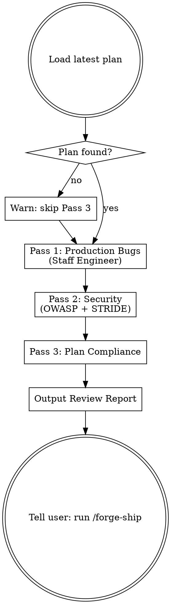

# Review — Multi-Perspective Quality Gate

Three passes: production bugs, security threats, plan compliance. Present findings; let the user decide.

## Process Flow



## Starting Check

Look for the latest plan in `docs/plans/` (sort `YYYY-MM-DD-*.md` by filename descending) for the plan compliance pass.

If no plan found: warn and skip the compliance pass.
> "No plan found in `docs/plans/` — skipping plan compliance pass. Running production bug and security passes only."

## Pass 1: Staff Engineer — Production Bugs

Think like a Staff Engineer doing pre-production review. For every component changed, ask:

- **Race conditions**: Is any shared state accessed concurrently without synchronization?
- **Error handling**: What happens when this throws? Is every error path handled or explicitly ignored?
- **Edge cases**: Empty input, null values, max values, concurrent requests, network timeouts?
- **Resource leaks**: Are connections, file handles, and streams closed in all paths including errors?
- **Assumptions**: What does this code assume about its callers? Are those assumptions enforced?
- **N+1 queries**: Does any loop make database or API calls?
- **Validation gaps**: Is input validated at system boundaries, or trusted too far inside?

Label each finding: `ASK` or `INFO` (see Fix Rules below).

## Pass 2: Security Officer — OWASP + STRIDE

Only report findings where you can describe a **concrete exploit scenario** in this format:
> "Attacker: [who]. Vector: [how they reach it]. Impact: [what they achieve]."

If you cannot fill in all three fields with specifics, do not report the finding.

**OWASP Top 10** — select checks relevant to the layers touched by this change:

*API / Backend:*
- Injection (SQL, command, LDAP, template)
- Broken authentication / session management
- Server-Side Request Forgery (SSRF) if URLs or remote resources are fetched
- Broken access control (can User A access User B's data?)
- Insecure deserialization
- Insufficient logging (are auth failures, access denials, and errors logged?)

*Frontend / HTML rendering:*
- XSS (user content reflected or rendered)
- Security misconfiguration (debug mode on, verbose errors)

*Data / Storage:*
- Sensitive data exposure (secrets in logs, unencrypted storage at rest)
- XML External Entity (XXE) — only if XML is parsed

*Dependencies:*
- Components with known vulnerabilities (check major dependency versions)

Skip categories that have zero relevance to the changed code. Do not force findings where none exist.

**STRIDE** — for each trust boundary in the changed code:
- **Spoofing**: Can an attacker impersonate another user or service?
- **Tampering**: Can data be modified in transit or at rest without detection?
- **Repudiation**: Can a user deny an action with no audit trail?
- **Information Disclosure**: What sensitive data could leak through this change?
- **Denial of Service**: What can be exhausted or crashed by an unauthenticated request?
- **Elevation of Privilege**: Can a low-privilege user gain higher access through this code path?

All security findings are `ASK` — never auto-fix security issues.

## Pass 3: Plan Compliance

Compare the implementation against the latest plan:
- Are all tasks listed in the plan actually implemented?
- Are the acceptance criteria for each task met?
- Is there implemented code with no corresponding plan task? (scope creep — flag as `INFO`)

Gaps in implementation are `ASK`. Scope creep is `INFO`.

## Fix Rules

All findings are **ASK** or **INFO**. Do not auto-fix any code — even mechanical changes can mask issues or conflict with the project's formatter/linter setup. Present findings; let the user decide.

**ASK** (requires human decision before changing):
- Any logic change
- Any interface change (function signature, API shape, data schema)
- All security findings
- Resource leaks, missing error handling
- Anything that changes observable behavior

**INFO** (notable but not blocking):
- Style observations (the project's linter should handle these)
- Potential dead code
- Scope creep (code with no corresponding plan task)

**Test runner discovery order** (stop at first match — same logic used in `/forge-ship`):
1. `package.json` → use `scripts.test`
2. `Makefile` → look for `test` target
3. `pyproject.toml` / `pytest.ini` → run `pytest`
4. `go.mod` → run `go test ./...`
5. `Cargo.toml` → run `cargo test`
6. `build.gradle` / `pom.xml` → run `./gradlew test` or `mvn test`

If no runner found: prompt the user for the test command.

## Output Format

```
## Review Report

### Pass 1: Production Bugs
ASK: [finding] — [why it needs your decision] — Recommended: [option A] or [option B]
INFO: [observation — notable but not blocking]

### Pass 2: Security
ASK: [finding] — Exploit: [attacker] → [vector] → [impact]

### Pass 3: Plan Compliance
ASK: [task N from plan] — not found in implementation
INFO: [code with no corresponding plan task — possible scope creep]
```

## Chaining

After delivering the report:
> "Review complete. Address the ASK items above. When resolved, run `/forge-ship` to verify and push."

**How to address ASK items:**
- **Logic / behavior change** → edit the code, then re-run the test suite to confirm no regression. No need to re-run `/forge-review` for a targeted fix — only re-run if the fix touches multiple files or changes an interface.
- **Security finding** → discuss the recommended fix with the user before changing anything. Security fixes often have non-obvious side effects.
- **Missing plan task** → implement it using the TDD loop from `/forge-build`, then re-run `/forge-review` Pass 3 only.
- **If an ASK item requires revisiting the design** → run `/forge-plan` to update the affected tasks, then return to `/forge-build` for those tasks.
