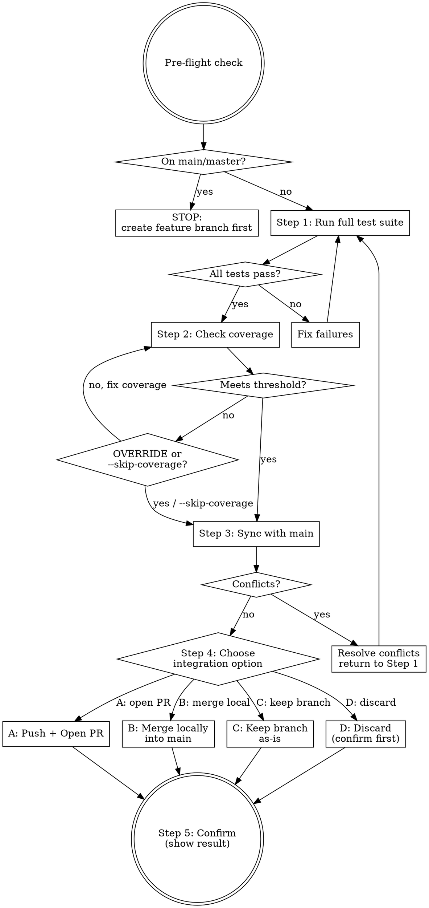

# Ship — Verified Release

No assertions without evidence. Show the output, then ship.

## Process Flow



## Pre-Flight Check

Before anything else, check the current branch:
- If on `main` or `master`: **stop immediately**.
  > "You're on `main`. Create a feature branch first: `git checkout -b feat/<name>`. Then re-run `/forge-ship`."
- If the branch has no commits ahead of main: warn and confirm before proceeding.

<HARD-GATE>
Cannot open a PR without showing actual passing test terminal output. If tests fail: fix them. Come back. Do not open a PR with failing tests under any circumstances.
</HARD-GATE>

## Step 1: Run the Full Test Suite

Run the complete test suite using the same test runner discovery order as `/forge-review` (package.json → Makefile → pyproject.toml → pytest.ini → go.mod → Cargo.toml → build.gradle/pom.xml). Show the actual terminal output in full — do not summarize, paraphrase, or infer.

If any test fails:
> "Tests are failing. Fix the failures before shipping."
> [show the full failure output]

Do not proceed to Step 2 until all tests pass and you have shown the green output.

## Step 2: Check Coverage

After tests pass, run coverage and show the report.

**Default threshold: 80%**

Threshold resolution order (stop at first match):
1. Project's own coverage config (`jest.config.js` coverageThreshold, `pyproject.toml [tool.coverage]`, `codecov.yml`, `.nycrc`)
2. `.fullstack` config file with key `coverage_threshold: <number>`
3. `COVERAGE_THRESHOLD` environment variable
4. Default: 80%

If coverage meets threshold: proceed.

If coverage is below threshold:
> "Coverage is X% — below the Y% threshold.
> Respond with OVERRIDE to proceed anyway, or re-run as `/forge-ship --skip-coverage`."

If `--skip-coverage` was passed by the user when invoking this skill: skip this step entirely and proceed to Step 3.

Wait for explicit response. Do not proceed without it.

## Step 3: Sync with Main

```bash
git fetch origin
git rebase origin/main   # preferred — keeps history linear
# or: git merge origin/main — if the repo convention uses merge commits
```

Check `git log --oneline origin/main..HEAD` first. If the branch has already been rebased and is clean, skip this step.

If conflicts exist: resolve them, then return to Step 1 (re-run the full test suite after rebasing/merging).

## Step 4: Choose Integration Option

After syncing cleanly with main, present the user with four options. Do not assume — always ask.

> "Tests pass. Branch is synced. How do you want to integrate?
>
> **A** — Open PR (push branch, open pull request for review)
> **B** — Merge locally (merge into main now, delete branch)
> **C** — Keep branch (stop here, come back later)
> **D** — Discard (delete branch and all changes)"

Wait for an explicit choice. Then execute:

### Option A: Open PR

```bash
git push origin <current-branch-name>
```

Open a PR with this description structure:

```markdown
## Summary
- [what this change does, one bullet per logical change]
- [why it was built — the user pain it addresses]

## Changes
- `path/to/file`: [what changed and why]

## Test Coverage
- [what the new/changed tests cover]
- Coverage: X%

## How to Test
1. [step-by-step manual verification]
2. [expected result at each step]
```

### Option B: Merge Locally

```bash
git checkout main
git merge --no-ff <branch-name>   # or: git merge --squash for a clean single commit
git push origin main
git branch -d <branch-name>
```

Re-run the test suite after merging to confirm nothing broke.

### Option C: Keep Branch

Do nothing. Confirm:
> "Branch `<name>` is clean, synced, and ready. No action taken. Resume with `/forge-build` or `/forge-ship` when ready."

### Option D: Discard

<HARD-GATE>
Before deleting, require the user to type the branch name exactly to confirm:
> "Type the branch name to confirm discard: `<branch-name>`"
Do NOT delete until the exact name is typed back.
</HARD-GATE>

```bash
git checkout main
git branch -D <branch-name>
```

> "Branch `<name>` deleted. All changes discarded."

## Step 5: Confirm

Report the outcome clearly:

- **After A:** "Shipped. PR: [URL] — Tests: [N passing]. Coverage: X%."
- **After B:** "Merged into main. Tests: [N passing]. Branch deleted."
- **After C:** "Branch kept. Nothing merged."
- **After D:** "Branch discarded."

Only say "Shipped" (options A or B) after you have shown the passing test output from Step 1.
