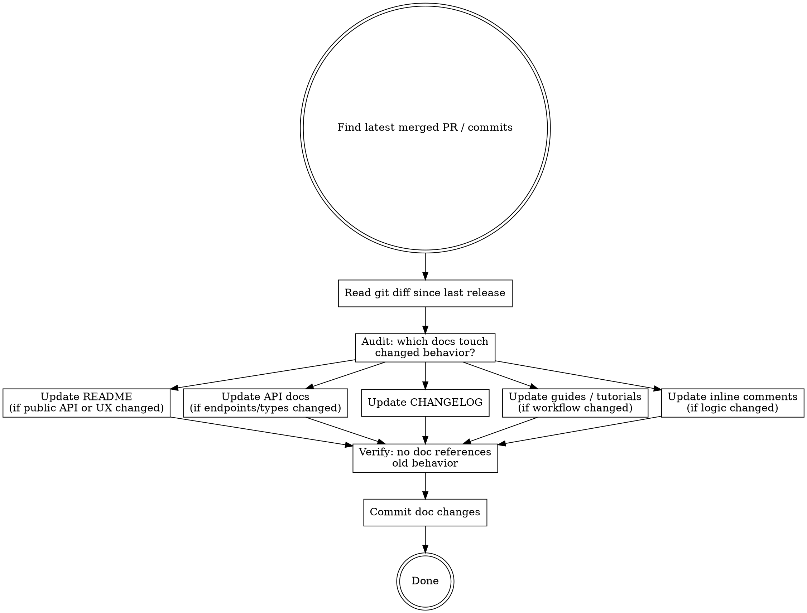

# Document Release — Keep Docs in Sync

Docs that lag behind the code are worse than no docs — they actively mislead. After every ship, update every document that describes what just changed.

<HARD-GATE>
Do NOT change any application code during this skill. Only documentation files (README, CHANGELOG, API docs, guides, comments). If you find a bug while reading the docs, log it as an issue — do not fix it here.
</HARD-GATE>

## Process Flow



## Step 1: Identify What Changed

Run:
```bash
git log --oneline -20
git diff <previous-tag>..HEAD -- . ':(exclude)*.test.*' ':(exclude)tests/'
```

If no previous tag, use the commit before the feature branch was cut. List every:
- New public function, endpoint, or CLI flag
- Changed function signature, return type, or behavior
- Removed or deprecated feature
- Changed configuration key or environment variable

## Step 2: Audit Docs That Need Updating

For each changed item from Step 1, find every file that documents it:

```bash
# Find docs that reference changed symbols/routes
grep -r "<changed-symbol>" docs/ README.md CHANGELOG.md
```

Build a list of files to update. Do not start writing until the full list is known.

## Step 3: Update Each Doc

### README
Update if:
- A public feature was added, changed, or removed
- Installation or setup steps changed
- A configuration key or environment variable changed

Keep the README focused on **what the project does and how to use it**. Do not add implementation details.

### API / Reference Docs
Update if any function signature, endpoint URL, request/response shape, or type definition changed.

Format: match the existing style of the file exactly. Do not introduce new formatting conventions.

### CHANGELOG
Always update. Follow the existing format of the file. If no CHANGELOG exists, create `CHANGELOG.md` with this structure:

```markdown
# Changelog

## [Unreleased]

### Added
- [new features]

### Changed
- [changed behavior]

### Deprecated
- [features that will be removed]

### Removed
- [features that were removed]

### Fixed
- [bug fixes]
```

Move `[Unreleased]` entries to a versioned section if a version tag was created during `/forge-ship`.

### Guides and Tutorials
Update step-by-step instructions that walk through changed workflows. Do not rewrite guides wholesale — find the specific steps that reference changed behavior and update them in place.

### Inline Code Comments
Update comments in application code that describe logic that changed. Only update comments that are now factually wrong — do not add new comments or rewrite existing accurate ones.

## Step 4: Verify No Stale References

After updating, search for any remaining references to old behavior:

```bash
grep -r "<old-function-name>\|<old-route>\|<old-config-key>" docs/ README.md
```

If found: update them. If the old name was an alias that still works, note it as deprecated — do not delete the reference.

## Step 5: Commit

```bash
git add <all-changed-doc-files>
git commit -m "docs: update documentation for <feature-name> release"
```

Do not bundle doc changes with code changes in the same commit.

## Chaining

After committing:
> "Documentation updated. Changed files: [list]. Run `/forge-retro` if you want a weekly shipping summary."
