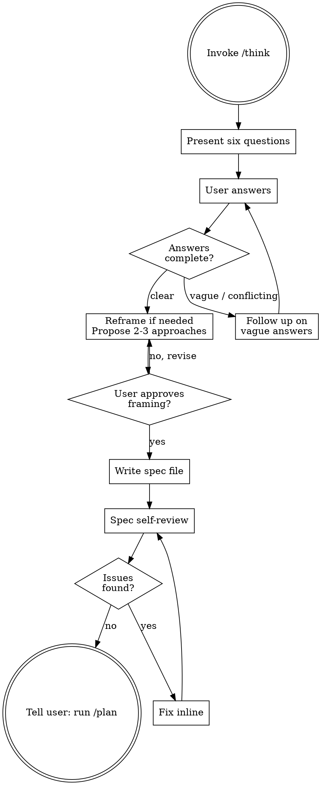

# Think — Product Thinking

Challenge the problem framing before writing a single line of code. Extract the real user pain. Propose approaches. Write a spec.

<HARD-GATE>
Do NOT write any code, create any files (except the spec), or take any implementation action during this skill. The only output is a design doc.
</HARD-GATE>

## Process Flow



## When to Use

Invoke `/think` whenever:
- Starting a new feature or significant change
- You have an idea but haven't defined the problem clearly
- You're about to ask for `/plan` but have no spec yet

## The Six Forcing Questions

Present all six questions at once so the user can answer in a single pass. If the user provided context when invoking `/think` (e.g., `/think I want rate limiting because bots scraped us 50k times`), mark questions already answered by that context and only ask the remaining ones.

1. **The Pain Question**: "What specific frustration or failure triggered this idea? Describe the last time this problem hurt you — what happened?"
2. **The Person Question**: "Who exactly has this pain? Name their role, their context, their frequency of hitting this problem."
3. **The Workaround Question**: "What do they do today instead? How bad is that workaround — cost, time, embarrassment?"
4. **The Timing Question**: "Why is this the right time to build this? What changed that makes this solvable now?"
5. **The Success Question**: "If this works perfectly, what's measurably different in 30 days? What can someone do that they couldn't before?"
6. **The Wedge Question**: "What's the smallest version you could ship tomorrow that proves the core idea works? What would you cut?"

If any answers are too vague or conflicting, follow up on those specific questions only — do not re-ask what's already clear.

## After the Six Questions

Based on the answers, push back on the framing if needed. Common reframes:
- "You said X, but what you described sounds more like Y."
- "The real pain is Z, not the feature you asked for."
- "The smallest wedge is actually this, not that."

Then propose **2-3 implementation approaches**:
- Lead with your recommendation and why
- Include effort estimate (hours/days)
- Include the key trade-off for each

Get explicit user approval: "Does this framing match what you're building? Shall I proceed to write the spec?"

## Writing the Spec

After approval, write the design doc to `docs/specs/YYYY-MM-DD-<topic>.md`.
Create the `docs/specs/` directory if it doesn't exist.

If a file at that path already exists: append `-2` (or the next available suffix) rather than overwriting.

Structure:

```markdown
# [Feature Name] — Design Spec
Date: YYYY-MM-DD

## Problem
[The real pain, in one paragraph]

## Users
[Who, how often, current workaround]

## Solution
[What we're building and why this approach]

## Approach
[The chosen implementation approach with rationale]

## Technical Constraints
[Known tech stack limitations, infrastructure requirements, compatibility needs, performance budgets]

## Out of Scope
[What we explicitly are NOT building]

## Success Criteria
[Measurable outcomes in 30 days]

## Open Questions
[Unresolved decisions that /plan must address]
```

## Spec Self-Review

After writing the spec, review it yourself before telling the user to proceed. This is a checklist you run inline — not a separate conversation turn.

**1. Placeholder scan** — search for TBD, TODO, "fill in", "TBD by", "to be determined". Fix every one. If you genuinely don't know, write it as an Open Question.

**2. Contradiction check** — does the Solution conflict with Out of Scope? Does the Approach conflict with Technical Constraints? Fix any contradictions.

**3. Scope realism** — given the Approach and Technical Constraints, is the Success Criteria achievable? If not, narrow the wedge or flag it as an Open Question.

**4. Open Questions audit** — are the listed Open Questions actually open? If you can answer them from what the user told you, answer them now rather than deferring to `/plan`.

Fix issues inline. No need to re-review after fixing — just correct and move on.

## Chaining

After writing and self-reviewing the spec, tell the user:
> "Spec written to `docs/specs/<filename>.md`. Run `/plan` to turn this into an architecture and implementation plan."
