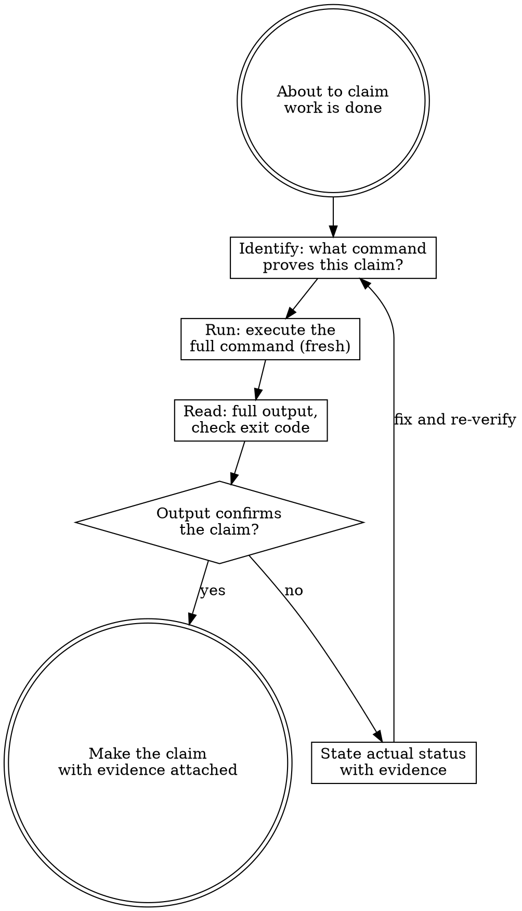

# Verify — Evidence Before Claims

Claiming work is complete without verification is not efficiency — it's dishonesty.

**Core principle:** Evidence before claims, always.

## The Iron Law

```
NO COMPLETION CLAIMS WITHOUT FRESH VERIFICATION EVIDENCE
```

If you haven't run the verification command in this response, you cannot claim it passes.

## Process Flow



## The Gate Function

Before any status claim or expression of completion:

```
1. IDENTIFY  — What command proves this claim?
2. RUN       — Execute the FULL command (fresh, not cached)
3. READ      — Full output. Check exit code. Count failures.
4. VERIFY    — Does output confirm the claim?
              → NO:  State actual status with evidence
              → YES: State claim WITH evidence included
5. CLAIM     — Only now
```

Skip any step = asserting without knowing.

## What Each Claim Requires

| Claim | Requires | Not Sufficient |
|-------|----------|----------------|
| "Tests pass" | Test command output: 0 failures | Previous run, "should pass" |
| "Linter clean" | Linter output: 0 errors | Partial check, inference |
| "Build succeeds" | Build command: exit 0 | Linter passing, logs look OK |
| "Bug fixed" | Test for original symptom: passes | Code changed, assumed fixed |
| "Regression test works" | Full red-green cycle verified | Test passes once |
| "Feature complete" | Line-by-line checklist against spec | Tests passing |
| "No conflicts" | `git status` output | Assumed clean |

## Red Flags — Stop Before Claiming

These phrases mean you haven't verified:
- "Should work now"
- "Probably passes"
- "Seems to be fixed"
- "I'm confident this is correct"
- "Looks good"
- "That should do it"
- Any satisfaction expression before showing output ("Done!", "Perfect!", "Great!")

**These all mean: run the command first, then speak.**

## Special Cases

### Regression Tests (TDD Red-Green)
A regression test is only valid if you've confirmed the full cycle:
```
✅ Write test → Run (MUST FAIL first) → Implement fix → Run (MUST PASS)
❌ "I've written a regression test for this"  (without showing both states)
```

### Requirements Checklist
Tests passing ≠ requirements met. Before claiming a feature complete:
1. Re-read the spec or plan
2. Create a checklist, one item per requirement
3. Verify each item against the running code
4. Report gaps or completion

### After Running `/forge-build` Tasks
Before saying a task is done:
- Run the specific test for that task
- Run the full test suite
- Show both outputs

## Common Rationalizations

| Excuse | Reality |
|--------|---------|
| "Should work now" | RUN the verification |
| "I'm confident" | Confidence ≠ evidence |
| "Linter passed" | Linter ≠ tests ≠ runtime |
| "I just ran it a moment ago" | Run it again. Freshness matters. |
| "Partial check is enough" | Partial proves nothing. |
| "This is a small change" | Small changes break things. Run the suite. |

## Chaining

After verification is complete and claim is supported by evidence:
> "Verified: [command run]. Output: [N tests pass / exit 0 / etc.]. [Claim]."

If verification fails:
> "Verification shows: [actual output]. [Issue to fix before claiming complete]."
