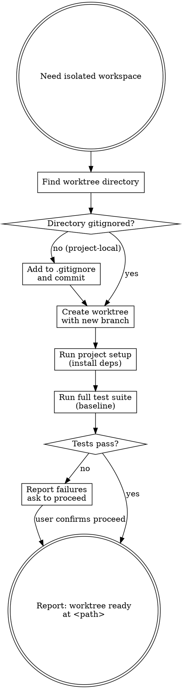

# Worktree — Isolated Feature Workspace

Git worktrees create isolated workspaces sharing the same repository. Work on a feature branch without disturbing your current checkout — no stashing, no branch switching.

**Core principle:** Verify the directory is gitignored before creating it. Always baseline the tests.

## Process Flow



## Step 1: Find Worktree Directory

Check in this order:

```bash
ls -d .worktrees 2>/dev/null   # preferred (hidden, project-local)
ls -d worktrees  2>/dev/null   # alternative
```

- If `.worktrees/` exists → use it
- If `worktrees/` exists → use it
- If both exist → use `.worktrees/`
- If neither exists → check `CLAUDE.md` for a preference, then ask:

```
No worktree directory found. Where should I create worktrees?

1. .worktrees/  (project-local, hidden)
2. ~/worktrees/<project-name>/  (outside the repo)

Which would you prefer?
```

## Step 2: Verify Gitignore (Project-Local Only)

If using `.worktrees/` or `worktrees/` inside the repo:

```bash
git check-ignore -q .worktrees 2>/dev/null || echo "NOT IGNORED"
```

If **not ignored**: add it to `.gitignore` and commit immediately.

```bash
echo ".worktrees/" >> .gitignore
git add .gitignore
git commit -m "chore: ignore worktree directory"
```

Do not create the worktree until the directory is ignored. Committing worktree contents by accident is a non-trivial cleanup.

If using a path outside the repo (`~/worktrees/`): skip this step.

## Step 3: Create the Worktree

```bash
project=$(basename "$(git rev-parse --show-toplevel)")
branch="feat/<feature-name>"

# Project-local
git worktree add .worktrees/$branch -b $branch

# Or global
git worktree add ~/worktrees/$project/$branch -b $branch

cd <worktree-path>
```

## Step 4: Run Project Setup

Auto-detect and install dependencies:

```bash
[ -f package.json ]      && npm install
[ -f yarn.lock ]         && yarn install
[ -f pnpm-lock.yaml ]    && pnpm install
[ -f Cargo.toml ]        && cargo build
[ -f requirements.txt ]  && pip install -r requirements.txt
[ -f pyproject.toml ]    && poetry install
[ -f go.mod ]            && go mod download
```

## Step 5: Baseline the Tests

```bash
# Use the same test runner discovery order as /forge-review and /forge-ship
```

- Tests pass → report ready
- Tests fail → report the failures, ask whether to proceed or investigate first

**Why baseline matters:** You need to know whether a test failure you see later was pre-existing or introduced by your changes. Never start work on a broken baseline without knowing it.

## Step 6: Report Ready

```
Worktree ready at: <full-path>
Branch: <branch-name>
Tests: N passing, 0 failures

Ready to implement <feature-name>. Run /forge-build (or /forge-delegate) to start.
```

## Cleanup

When the feature is done and merged (or discarded):

```bash
git worktree remove <worktree-path>
git branch -d <branch-name>        # if merged
# or
git branch -D <branch-name>        # if discarding
```

## Quick Reference

| Situation | Action |
|-----------|--------|
| `.worktrees/` exists | Use it (verify gitignored) |
| `worktrees/` exists | Use it (verify gitignored) |
| Both exist | Use `.worktrees/` |
| Neither | Check CLAUDE.md → ask |
| Not gitignored | Add to .gitignore, commit, then create |
| Tests fail on baseline | Report failures, ask to proceed |

## Red Flags

**Never:**
- Create a project-local worktree in a directory that isn't gitignored
- Skip the baseline test run
- Start implementation on `main`/`master` — the whole point is a separate branch

## Chaining

After worktree is ready:
> "Worktree ready. Run `/forge-build` to implement with TDD, or `/forge-delegate` for parallel task execution."
