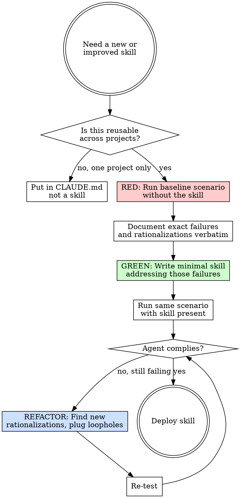
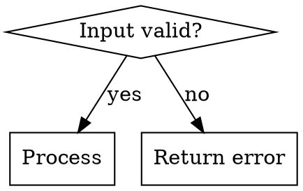

# Write Skill — Creating and Improving Forge Skills

Writing a skill is Test-Driven Development applied to process documentation.

**Core principle:** If you didn't watch an agent fail without the skill, you don't know if the skill teaches the right thing.

## The Iron Law

```
NO SKILL DEPLOYED WITHOUT A BASELINE TEST FIRST
```

Run a test scenario WITHOUT the skill. Document what the agent does naturally. Then write the skill that addresses those specific failures. Same Red-Green-Refactor cycle as code TDD.

## Process Flow



## When to Create a Skill

**Create when:**
- A technique wasn't intuitively obvious and you'd reference it again
- Pattern applies broadly across projects
- Agents consistently make the same mistake without it

**Don't create for:**
- One-off solutions
- Project-specific conventions → put in `CLAUDE.md`
- Standard practices well-documented elsewhere
- Mechanical constraints → automate with a linter, not documentation

## File Structure

```
skills/
  skill-name/
    SKILL.md          # Required
    supporting.*      # Only if needed (heavy reference or reusable scripts)
```

Keep inline: principles, code patterns under 50 lines, everything else.
Separate file for: API reference over 100 lines, reusable scripts, templates.

## SKILL.md Frontmatter Rules

```yaml
---
name: skill-name          # letters, numbers, hyphens only — NO parentheses or special chars
description: "..."        # see CSO section below
---
```

Max 1024 characters total in frontmatter. Both fields required.

## CSO — Claude Search Optimization

Claude reads the `description` to decide whether to load a skill. Make it answer: "Should I read this right now?"

### Description: Triggering Conditions Only

**Critical rule:** The description must describe WHEN to use the skill, NOT what the skill does.

If the description summarizes the workflow, Claude may follow the description summary instead of reading the full skill content. A description that says "dispatches one subagent per task with review between tasks" can cause Claude to do exactly one review — because it followed the description shortcut instead of reading the flowchart that shows two reviews.

```yaml
# ❌ BAD: Summarizes the workflow
description: "Use when building — dispatches subagent per task, runs spec review then quality review"

# ❌ BAD: Too abstract
description: "For async testing"

# ✅ GOOD: Triggering conditions only
description: "Use when executing an implementation plan task by task in the current session"

# ✅ GOOD: Symptoms + trigger
description: "Use when tests are flaky, have race conditions, or pass/fail inconsistently"
```

Start with "Use when..." — it forces you to write triggering conditions rather than summaries.

### Keywords for Discovery

Use words Claude would search for:
- Error messages verbatim: "race condition", "ENOTEMPTY"
- Symptoms: "flaky", "blocked", "failing baseline"
- Tools and commands: `git worktree`, `pytest`, `cargo test`
- Synonyms: "timeout/hang/freeze", "cleanup/teardown"

### Naming

Use active, descriptive names:
- ✅ `write-skill` not `skill-creation`
- ✅ `worktree` not `git-worktree-management`
- ✅ `debug` not `debugging-techniques`

## Content Structure

```markdown
---
name: skill-name
description: "Use when [specific triggering conditions]"
---

# Skill Name — Short Tagline

One-sentence core principle.

## Process Flow
[Graphviz diagram — only if the process has non-obvious decisions]

## When to Use
[Bullet list of symptoms and triggers, plus when NOT to use]

## [Main Content]
[Steps, rules, patterns]

## Red Flags
[What to watch for, what to stop doing]

## Chaining
[What skill to run next, if applicable]
```

## Flowchart Rules

Use a `.dot` flowchart **only** for:
- Non-obvious decision points where you might go wrong
- Loops where you might stop too early
- "Use A vs B" decisions

**Never** use flowcharts for:
- Linear numbered lists → use numbered markdown
- Reference material → use tables
- Labels without semantic meaning (step1, helper2)



## Bulletproofing Discipline Skills

For skills that enforce a rule (like `/debug`, `/verify`, `/build`), agents will find loopholes under pressure. Close them explicitly.

**1. Forbid specific workarounds, not just the general rule:**
```markdown
# ❌ Weak
Write code before test? Delete it.

# ✅ Strong
Write code before test? Delete it — not "keep as reference," not "adapt while writing tests." Delete.
```

**2. Add the spirit vs letter principle early:**
```markdown
Violating the letter of this rule is violating the spirit of the rule.
```

**3. Build a rationalization table from your baseline test:**

```markdown
| Excuse | Reality |
|--------|---------|
| "This case is too simple" | Simple things break too. |
| "I'm under time pressure" | Systematic is faster than thrashing. |
```

**4. Add a Red Flags list** — makes it easy for agents to self-interrupt.

## Testing Your Skill

### Discipline skills (rules that agents resist)
Run scenarios with combined pressures: time + sunk cost + "it's obvious." Document every rationalization verbatim. Add explicit counters for each one.

### Technique skills (how-to guides)
Run application scenarios. Can the agent use the technique on a new problem correctly?

### Reference skills (API docs, command guides)
Run retrieval + application scenarios. Can the agent find and correctly use the information?

**All skills:** Run with the skill absent first (baseline). Then add the skill. The compliance rate should go up.

## Common Mistakes

| Mistake | Fix |
|---------|-----|
| Description summarizes workflow | Write triggering conditions only |
| Deploy without baseline test | Run baseline first, always |
| Skill for one-off situation | Put in CLAUDE.md |
| Over-engineered for hypothetical cases | Address actual baseline failures, no more |
| Multi-language examples | One excellent example is enough |
| Labels without meaning (step1, helper2) | Use semantic labels |

## Chaining

After deploying a skill:
> "Skill deployed at `skills/<name>/SKILL.md`. Run a trigger test: present a scenario that should invoke it and verify the agent loads it without being told to."
